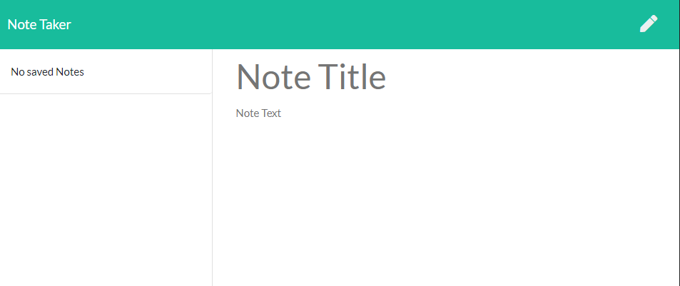
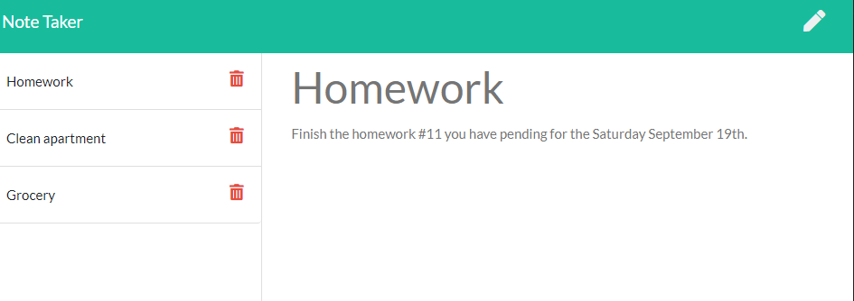

# HW11-NoteTaker

### Heroku App Link: https://protected-taiga-82398.herokuapp.com/notes.html

## Description

This project does you can create notes to save info you want to save it for later.
this app can createa a list of notes where you can add a Title for the Note also Text with the description of the note.

## Table of contents

- [Installation](#installation)
- [Usage](#usage)
- [Test](#test)
- [Credits](#credits)
- [License](#license)
- [Questiones](#Questiones)

## Installation

Run the terminal the main file called "server.js" with Node.

## Usage

To createa new note, just click in the pen icon to crate a new one
to save a note, click in the save button after typed the title and the text
to check a previous note, just click in the note from the note list.

#### New Note

    * Title
    * Text

## Test

"Node server.js"

"Note Title:" Do homework

"Note Text:" finish homework before September 19th

## Empty Page

### Example Page

## Credits

- Aldo Carrillo

## License

MIT License

Copyright (c) 2020 Aldo Carrillo

Permission is hereby granted, free of charge, to any person obtaining a copy
of this software and associated documentation files (the "Software"), to deal
in the Software without restriction, including without limitation the rights
to use, copy, modify, merge, publish, distribute, sublicense, and/or sell
copies of the Software, and to permit persons to whom the Software is
furnished to do so, subject to the following conditions:

The above copyright notice and this permission notice shall be included in all
copies or substantial portions of the Software.

THE SOFTWARE IS PROVIDED "AS IS", WITHOUT WARRANTY OF ANY KIND, EXPRESS OR
IMPLIED, INCLUDING BUT NOT LIMITED TO THE WARRANTIES OF MERCHANTABILITY,
FITNESS FOR A PARTICULAR PURPOSE AND NONINFRINGEMENT. IN NO EVENT SHALL THE
AUTHORS OR COPYRIGHT HOLDERS BE LIABLE FOR ANY CLAIM, DAMAGES OR OTHER
LIABILITY, WHETHER IN AN ACTION OF CONTRACT, TORT OR OTHERWISE, ARISING FROM,
OUT OF OR IN CONNECTION WITH THE SOFTWARE OR THE USE OR OTHER DEALINGS IN THE
SOFTWARE.

## Questiones

- GitHub link: https://github.com/AldoCarrillo
- Email: aldo.carrillo22@gmail.com
